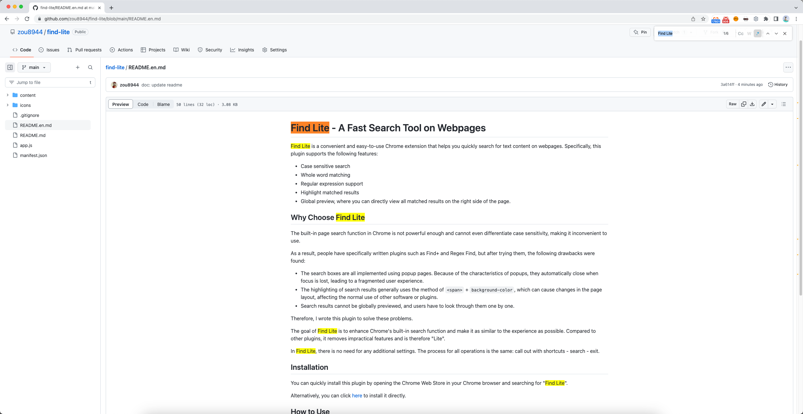

# Find Lite - A Fast Search Tool on Webpages

Find Lite is a convenient and easy-to-use Chrome extension that helps you quickly search for text content on webpages. Specifically, this plugin supports the following features:

- Case sensitive search
- Whole word matching
- Regular expression support
- Highlight matched results
- Global preview, where you can directly view all matched results on the right side of the page.

## Why Choose Find Lite

The built-in page search function in Chrome is not powerful enough and cannot even differentiate case sensitivity, making it inconvenient to use.

As a result, people have specifically written plugins such as Find+ and Regex Find, but after trying them, the following drawbacks were found:

- The search boxes are all implemented using popup pages. Because of the characteristics of popups, they automatically close when focus is lost, leading to a fragmented user experience.
- The highlighting of search results generally uses the method of `` + `background-color`, which can cause changes in the page layout, affecting the normal use of other software or plugins.
- Search results cannot be globally previewed, and users have to look through them one by one.

Therefore, I wrote this plugin to solve these problems.

The goal of Find Lite is to enhance Chrome's built-in search function and make it as similar to the experience as possible. Compared to other plugins, it removes impractical features and is therefore "Lite".

In Find Lite, there is no need for any additional settings. The process for all operations is the same: call out with shortcuts - search - exit.

## Installation

You can quickly install this plugin by opening the Chrome Web Store in your Chrome browser and searching for "Find Lite".

Alternatively, you can click [here](https://chrome.google.com/webstore/detail/find-lite/ndjgjgjgjgjgjgjgjgjgjgjgj) to install it directly.

## How to Use

After installation, there is no need for any additional settings. All operations are almost the same as Chrome's built-in search function:

- `Ctrl+Shift+F`(Windows) or `Command+Shift+F`(Mac) to call out the search box.
- Enter the search content and press `Enter` to start searching.
- Press `Enter` again to cycle through the search results.
- Press `Shift+Enter` to cycle through the search results in reverse order.
- Press `Esc` to exit the search.

> Tips
> - After selecting text, pressing `Ctrl+Shift+F`(Windows) or `Command+Shift+F`(Mac) lets you use the selected text as the search content, and the selected text will be highlighted and focused as the first matched result.
> - All search results will be highlighted, but only one result is the current one, and the style will be further highlighted. I call this highlighting focus.
> - The logic for selecting the first highlighted focus: select the result closest to the center of the viewport, and if there are multiple results, select the one that is closest to the top. If there are no results in the viewport, select the first result.

## Preview

## Contribution

If you find a bug, please submit an issue. If you have any good suggestions, please submit a pull request.